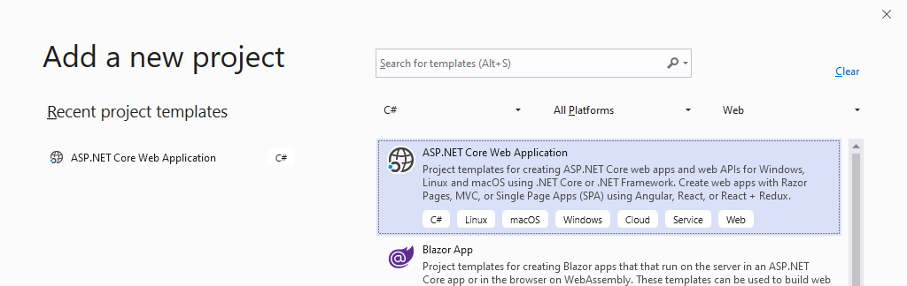
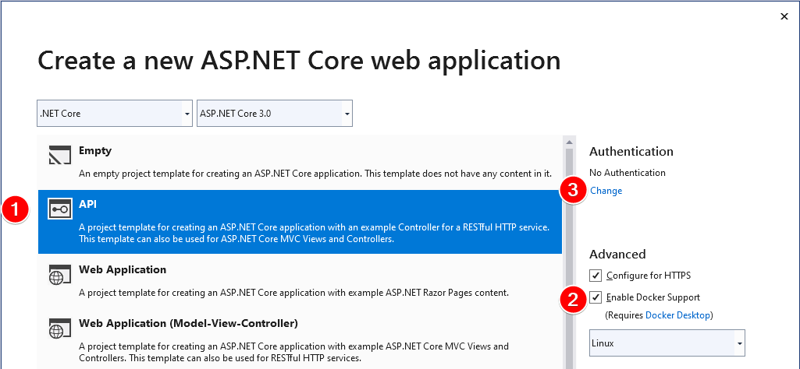

# The many faces of cloud services in containers

For the [Rochester .NET User Group](https://www.meetup.com/Visual-Developers-of-Upstate-New-York-VDUNY/events/264624674/), October 2019

In this presentation I'm going to be flying through the actual creation of the apps. Hopefully, we'll have time to come back and dig into this in a future presentation. For now, here are the basics:

## The Application: Blazor, ASP.NET, and OpenAPI

Using the new .NET Core 3, we will create a Blazor WASM front end, and a .NET Core 3.0 back end web API based on OpenAPI.

You need:

- [.NET Core](https://dotnet.microsoft.com/download/dotnet-core/3.0) 3.0 which is included with the latest Visual Sdutio
- [Visual Studio](https://visualstudio.microsoft.com/vs/) I'm using the [Preview](https://visualstudio.microsoft.com/vs/preview/) release.

### A .NET API project

- First, create an ASP.NET Core Web Application.



- Choose an API project, and configure Docker support. We'll deal with Authentication later ...


- Add a few packages ...

```PowerShell
Install-Package NSwag.AspNetCore
```

- Configure OpenAPI, by adding Swagger to services and middleware

- Write a ToDoTask and a ToDoController, with XML Documentation

### A Blazor Client project

Generate some client code with [NSwag](https://github.com/RicoSuter/NSwag). I tried the generator in [swagger-codegen](https://github.com/swagger-api/swagger-codegen#compatibility) but their `csharp-dotnet2` generated synchronous REST calls, which is just unforgivable.


## The Container

In order to make the project cross-platform and cross-cloud, to make building and deploying (and debugging) not depend on or be disrupted by vagaries in your development environment, we have decided to package our apps as containers. We manage those containers with Docker, and configure them during development in Visual Studio with a Dockerfile and Docker-Compose.yaml files.

For simplicity (and because this isn't a presentation about docker) I'm using the Dockerfile that Visual Studio creates.


## How many ways can we host it?

Containers are quickly coming as an option to many of Azure's different compute offerings. As of today, there are at five different ways to host containers in Azure --not counting their container registry service for storing images (think Docker hub, or nuget):

- Container Instances, the simples way to host a container
- Batch, for high performance compute
- App Service, for managed web apps and services
- Service Fabric, Microsoft's microservices orchestrator
- Azure Kubernetes Service, the open source container orchestrator

Although there's a table on the main [containers on Azure](https://azure.microsoft.com/en-us/product-categories/containers/) page with a list of these hosting types, I highly recommend this flowchart [decision tree for Azure compute services](https://docs.microsoft.com/en-us/azure/architecture/guide/technology-choices/compute-decision-tree) on docs.microsoft.com, because it makes the distinctions clearer.

The one last thing I should add here, beyond what I may discuss live in person, is that Kubernetes is the only one of these services that is _basically_ the same when hosting on Azure as on AWS or GCP. That is: because Kubernetes is such a full-featured container orchestrator, you won't need to lean very much on Azure-specific services when you deploy there. The result is a whole layer of sophistication and complication that's quite different from the rest of Azure, but will be the same regardless of what company's cloud you choose to use.


## The stuff I didn't get to in my presentation

1. There are simple ways of hosting multiple containers in ACI (Azure Container Instances) that are very much like docker-compose, using a [multi-container YAML file](https://docs.microsoft.com/en-us/azure/container-instances/container-instances-multi-container-yaml) you can easily load a group of containers all at once with the one-line command:

    az container create --resource-group VDUNYToDoService --file todo-aci.yaml

2. Of course, once you've done all the work of creating the Kubernetes cluster and assigning VMs and resources to it, pulling up a collection of web services all at once is easy there too:

    kubectl apply -f .\todo-k8s.yaml


# Bonus Content:

## .NET Core 3.0 was released at the end of last month ...

See [announcement blog post](https://devblogs.microsoft.com/aspnet/asp-net-core-and-blazor-updates-in-net-core-3-0/) and full [What's New docs](https://docs.microsoft.com/en-us/aspnet/core/release-notes/aspnetcore-3.0?view=aspnetcore-3.0).

This project incorporates OpenAPI (and generated client code), the new JSON serializer, IdentityServer authentication support and many other new features, and we'll hopefully re-visit this to talk about some of those in a future meeting.

Some of the big new features in this release of ASP.NET Core include:

    - Create high-performance backend services with gRPC.
        - [Can't host on Azure App Services, fix requires IIS and Windows kernel changes](https://github.com/aspnet/AspNetCore/issues/9020#issuecomment-486990716)
        - I was originally going to use this for our talk today, but it restricted my options, so we'll have to save this for another talk...
        - Useful gRPC GUI Explorer Client https://github.com/uw-labs/bloomrpc/releases
    - SignalR now has support for automatic reconnection and client-to-server streaming.
    - Generate strongly typed client code for Web APIs with OpenAPI documents.
    - Endpoint routing integrated through the framework.
    - HTTP/2 now enabled by default in Kestrel.
    - Authentication support for Web APIs and single-page apps integrated with [IdentityServer](https://identityserver.io/).
    - Support for certificate and Kerberos authentication.
    - Integrates with the new System.Text.Json serializer.
    - New generic host sets up common hosting services like dependency injection (DI), configuration, and logging.
    - New Worker Service template for building long-running services.
    - New EventCounters created for requests per second, total requests, current requests, and failed requests.
    - Startup errors now reported to the Windows Event Log when hosted in IIS.
    - Request pipeline integrated with with System.IO.Pipelines.
    - Build rich interactive client-side web apps using C# instead of JavaScript using [Blazor](https://blazor.net/).
        - Blazor WebAssembly is still in preview. You can install it with:
        `dotnet new -i Microsoft.AspNetCore.Blazor.Templates::3.0.0-preview9.19465.2`
    - Performance improvements across the entire stack.

##

